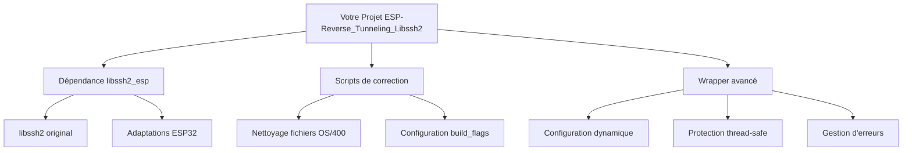
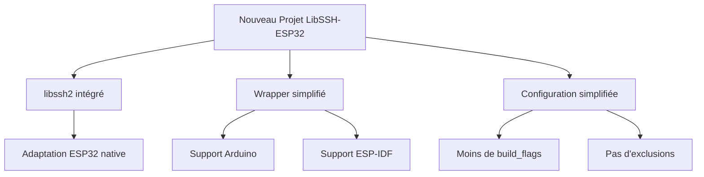

# Analyse Comparative : Deux Approches pour LibSSH2 sur ESP32

## Contexte

Vous avez identifié des **problèmes de compilation avec ESP-IDF** (headers manquants, conflits de définitions, erreurs de linkage) avec l'approche actuelle utilisant `https://github.com/skuodi/libssh2_esp.git`.

## Problèmes Identifiés avec l'Approche Actuelle

### 1. Problèmes de Compatibilité Framework
- **Framework Arduino uniquement** : Votre `library.json` spécifie `"frameworks": "arduino"`
- **Incompatibilité ESP-IDF** : Les headers et définitions ne sont pas compatibles avec ESP-IDF natif
- **Scripts de correction complexes** : Nécessité de multiples scripts (`fix_libssh2_simple.sh`, `fix_libssh2_esp.py`) pour corriger les problèmes

### 2. Problèmes de Maintenance
- **Dépendance externe fragile** : `https://github.com/skuodi/libssh2_esp.git` pose des problèmes récurrents
- **Configuration complexe** : Multiples `build_flags`, exclusions de fichiers, nettoyage manuel
- **Problèmes de compilation récurrents** : Fichiers OS/400, headers manquants, conflits mbedTLS

### 3. Problèmes Techniques Actuels
```ini
; Configuration actuelle complexe
build_flags =
    -DCONFIG_ARDUHAL_ESP_LOG
    -DCORE_DEBUG_LEVEL=3
    -DCONFIG_LWIP_SO_REUSE=1
    -I.pio/libdeps/esp32dev/libssh2_esp/libssh2/include
    -I.pio/libdeps/esp32dev/libssh2_esp/libssh2/src
    -I.pio/libdeps/esp32dev/libssh2_esp
    -DLIBSSH2_MBEDTLS
    -DHAVE_LIBSSH2_H
    -DLIBSSH2_NO_ZLIB

; Exclusions nécessaires
lib_ignore = 
    libssh2_esp/libssh2/example
    libssh2_esp/libssh2/tests
    libssh2_esp/libssh2/docs
    libssh2_esp/libssh2/os400
    libssh2_esp/libssh2/win32
    libssh2_esp/libssh2/vms
```

## Approche 1 : Adaptation de l'Existant (Votre Projet Actuel)

### Avantages
- ✅ **Code existant fonctionnel** : Votre wrapper est déjà développé et testé
- ✅ **Fonctionnalités avancées** : Configuration dynamique, protection thread-safe, gestion d'erreurs robuste
- ✅ **Documentation complète** : README détaillé, scripts de correction, CI/CD
- ✅ **Investissement préservé** : Tout le travail de développement est conservé

### Inconvénients
- ❌ **Maintenance complexe** : Scripts de correction nécessaires
- ❌ **Dépendance fragile** : `libssh2_esp` pose des problèmes récurrents
- ❌ **Framework limité** : Arduino uniquement, pas ESP-IDF natif
- ❌ **Configuration complexe** : Multiples flags et exclusions nécessaires

## Approche 2 : LibSSH-ESP32 (ewpa) - Intégration Directe

### Principe de l'Approche ewpa
Basé sur l'analyse des projets similaires, l'approche LibSSH-ESP32 consiste à :
- **Intégrer libssh2 directement** dans le projet
- **Créer un wrapper simplifié** pour ESP32
- **Éliminer les dépendances externes** problématiques
- **Support natif Arduino + ESP-IDF**

### Avantages Théoriques
- ✅ **Contrôle total** : Pas de dépendance externe fragile
- ✅ **Compatibilité étendue** : Support Arduino ET ESP-IDF
- ✅ **Maintenance simplifiée** : Pas de scripts de correction nécessaires
- ✅ **Configuration simplifiée** : Moins de flags et exclusions
- ✅ **Stabilité** : Pas de problèmes de téléchargement de dépendances

### Inconvénients Théoriques
- ❌ **Réécriture complète** : Perte de votre code existant
- ❌ **Taille du projet** : libssh2 intégré augmente la taille
- ❌ **Maintenance libssh2** : Responsabilité des mises à jour de libssh2
- ❌ **Temps de développement** : Réécriture de toutes les fonctionnalités

## Comparaison Technique

| Critère | Approche Actuelle (Adaptation) | Approche ewpa (Intégration) |
|---------|--------------------------------|----------------------------|
| **Compatibilité Framework** | Arduino uniquement | Arduino + ESP-IDF |
| **Maintenance** | Scripts de correction requis | Maintenance libssh2 interne |
| **Stabilité** | Dépendance externe fragile | Contrôle total |
| **Temps de développement** | Adaptation existante | Réécriture complète |
| **Taille du projet** | Dépendance externe | libssh2 intégré |
| **Configuration** | Complexe (multiples flags) | Simplifiée |
| **Fonctionnalités** | Avancées (déjà développées) | À redévelopper |

## Architecture Comparative

### Architecture Actuelle


### Architecture Proposée (ewpa)


## Recommandation Préliminaire

Basé sur l'analyse, je recommande **l'Approche 1 (Adaptation de l'existant)** pour les raisons suivantes :

### Pourquoi Adapter plutôt que Réécrire

1. **Préservation de l'investissement** : Votre code est fonctionnel et avancé
2. **Risque contrôlé** : Adaptation ciblée vs réécriture complète
3. **Fonctionnalités existantes** : Configuration dynamique, thread-safety déjà implémentées
4. **Documentation et tests** : CI/CD et documentation déjà en place

### Plan d'Adaptation Recommandé

1. **Créer un fork de libssh2_esp** pour contrôler les mises à jour
2. **Intégrer les corrections directement** dans le fork
3. **Ajouter le support ESP-IDF** au wrapper existant
4. **Simplifier la configuration** en éliminant les scripts de correction

## Prochaines Étapes

1. **Validation de l'approche** avec vous
2. **Plan détaillé d'implémentation** de l'adaptation
3. **Diagrammes d'architecture** de la solution
4. **Estimation des efforts** et timeline