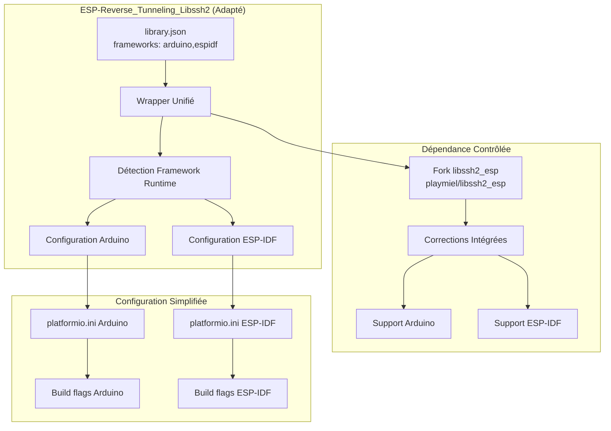
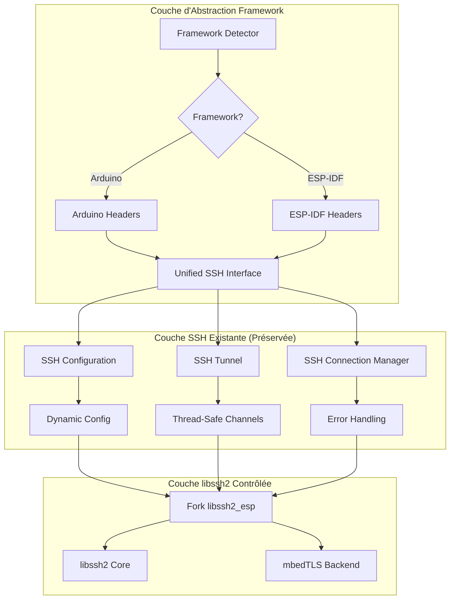
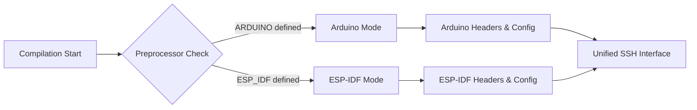

# Plan d'Implémentation Détaillé : Adaptation pour Support Arduino + ESP-IDF

## Résumé Exécutif

**Recommandation finale** : Adapter votre projet existant pour supporter `framework = arduino,espidf` plutôt que de réécrire complètement.

**Justification** : Préservation de l'investissement, fonctionnalités avancées existantes, et risque contrôlé.

## Architecture de la Solution Recommandée

### Vue d'Ensemble de l'Architecture Cible



### Architecture Détaillée du Wrapper



## Plan d'Implémentation en 4 Phases

### Phase 1 : Préparation et Fork (1-2 jours)

#### Objectifs
- Créer un fork contrôlé de libssh2_esp
- Intégrer les corrections existantes
- Préparer l'infrastructure

#### Actions Détaillées

1. **Créer le fork libssh2_esp**
   ```bash
   # Fork https://github.com/skuodi/libssh2_esp.git
   # vers https://github.com/playmiel/libssh2_esp.git
   ```

2. **Intégrer les corrections existantes**
   - Appliquer automatiquement les corrections des scripts
   - Supprimer définitivement les fichiers OS/400
   - Configurer mbedTLS par défaut

3. **Mettre à jour les dépendances**
   ```json
   // library.json
   {
     "dependencies": {
       "libssh2_esp": "https://github.com/playmiel/libssh2_esp.git"
     }
   }
   ```

#### Livrables Phase 1
- ✅ Fork libssh2_esp opérationnel
- ✅ Corrections intégrées
- ✅ Tests de compilation Arduino réussis

### Phase 2 : Détection Framework (2-3 jours)

#### Objectifs
- Implémenter la détection automatique du framework
- Créer les configurations spécifiques
- Maintenir la compatibilité existante

#### Architecture de Détection



#### Implémentation

1. **Créer le détecteur de framework**
   ```cpp
   // src/framework_detector.h
   #ifndef FRAMEWORK_DETECTOR_H
   #define FRAMEWORK_DETECTOR_H
   
   #ifdef ARDUINO
   #define FRAMEWORK_ARDUINO
   #include <Arduino.h>
   #include <WiFi.h>
   #elif defined(ESP_IDF)
   #define FRAMEWORK_ESPIDF
   #include "esp_system.h"
   #include "esp_wifi.h"
   #endif
   
   class FrameworkDetector {
   public:
       static bool isArduino();
       static bool isESPIDF();
       static void initializeFramework();
   };
   
   #endif
   ```

2. **Adapter les headers existants**
   ```cpp
   // src/ESP-Reverse_Tunneling_Libssh2.h
   #include "framework_detector.h"
   
   #ifdef FRAMEWORK_ARDUINO
   #include "arduino_ssh_wrapper.h"
   #elif defined(FRAMEWORK_ESPIDF)
   #include "espidf_ssh_wrapper.h"
   #endif
   ```

#### Livrables Phase 2
- ✅ Détection framework fonctionnelle
- ✅ Headers adaptés
- ✅ Compilation Arduino maintenue

### Phase 3 : Support ESP-IDF (3-4 jours)

#### Objectifs
- Implémenter le support ESP-IDF natif
- Adapter les configurations réseau
- Maintenir l'API unifiée

#### Configuration ESP-IDF

1. **Créer platformio.ini ESP-IDF**
   ```ini
   [env:esp32dev-espidf]
   platform = espressif32
   board = esp32dev
   framework = espidf
   monitor_speed = 115200
   
   lib_deps =
       https://github.com/playmiel/libssh2_esp.git
   
   build_flags =
       -DESP_IDF
       -DLIBSSH2_MBEDTLS
       -DHAVE_LIBSSH2_H
       -DLIBSSH2_NO_ZLIB
   ```

2. **Adapter le wrapper pour ESP-IDF**
   ```cpp
   // src/espidf_ssh_wrapper.cpp
   #ifdef FRAMEWORK_ESPIDF
   
   #include "esp_log.h"
   #include "esp_wifi.h"
   #include "lwip/sockets.h"
   
   class ESPIDFSSHWrapper : public SSHTunnel {
   private:
       void initializeWiFi();
       void setupLogging();
   public:
       bool init() override;
   };
   
   #endif
   ```

#### Livrables Phase 3
- ✅ Support ESP-IDF fonctionnel
- ✅ Configuration réseau adaptée
- ✅ API unifiée maintenue

### Phase 4 : Tests et Documentation (2-3 jours)

#### Objectifs
- Tester les deux frameworks
- Mettre à jour la documentation
- Valider la migration

#### Tests Complets

1. **Tests de compilation**
   ```bash
   # Test Arduino
   pio run -e esp32dev-arduino
   
   # Test ESP-IDF
   pio run -e esp32dev-espidf
   ```

2. **Tests fonctionnels**
   - Connexion SSH dans les deux frameworks
   - Tunneling fonctionnel
   - Gestion d'erreurs
   - Performance

#### Documentation

1. **Mettre à jour README.md**
   - Instructions pour Arduino
   - Instructions pour ESP-IDF
   - Migration depuis l'ancienne version

2. **Créer des exemples**
   - `examples/arduino/` : Exemple Arduino
   - `examples/espidf/` : Exemple ESP-IDF

#### Livrables Phase 4
- ✅ Tests complets réussis
- ✅ Documentation mise à jour
- ✅ Exemples fonctionnels

## Avantages de cette Approche

### Avantages Techniques
1. **Préservation du code existant** : Toutes vos fonctionnalités avancées sont conservées
2. **Contrôle des dépendances** : Fork libssh2_esp élimine les problèmes de maintenance
3. **Compatibilité étendue** : Support Arduino ET ESP-IDF
4. **Migration progressive** : Pas de rupture pour les utilisateurs existants

### Avantages Business
1. **ROI préservé** : Investissement de développement conservé
2. **Risque maîtrisé** : Adaptation vs réécriture complète
3. **Time-to-market** : Plus rapide qu'une réécriture
4. **Maintenance simplifiée** : Élimination des scripts de correction

## Comparaison Effort vs Bénéfice

| Approche | Effort (jours) | Risque | Bénéfices |
|----------|----------------|--------|-----------|
| **Adaptation (Recommandée)** | 8-12 | Faible | ✅ Préservation code<br/>✅ Support dual framework<br/>✅ Contrôle dépendances |
| **Réécriture ewpa** | 20-30 | Élevé | ✅ Contrôle total<br/>❌ Perte fonctionnalités<br/>❌ Redéveloppement complet |

## Risques et Mitigation

### Risques Identifiés
1. **Compatibilité ESP-IDF** : Différences d'API réseau
2. **Performance** : Impact de la couche d'abstraction
3. **Maintenance** : Gestion du fork libssh2_esp

### Stratégies de Mitigation
1. **Tests extensifs** : Validation sur les deux frameworks
2. **Benchmarking** : Mesure de performance
3. **Automatisation** : CI/CD pour les deux frameworks

## Prochaines Étapes

1. **Validation de l'approche** : Confirmation de votre part
2. **Démarrage Phase 1** : Création du fork et intégration corrections
3. **Planning détaillé** : Définition des jalons et livrables
4. **Mise en œuvre** : Exécution du plan en 4 phases

Cette approche vous permet de **préserver votre investissement** tout en **résolvant les problèmes de compatibilité** identifiés, avec un **risque contrôlé** et un **effort raisonnable**.