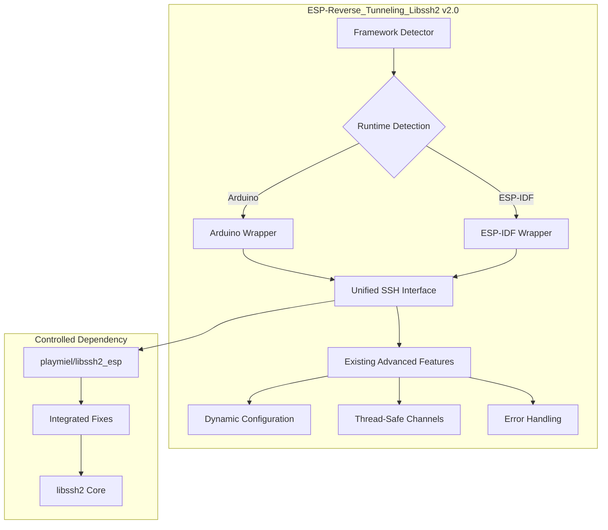

# Recommandation Finale : Stratégie LibSSH2 pour ESP32

## Résumé Exécutif

**RECOMMANDATION** : Adapter votre projet existant `ESP-Reverse_Tunneling_Libssh2` pour supporter `framework = arduino,espidf`

**JUSTIFICATION** : Cette approche préserve votre investissement de développement tout en résolvant les problèmes de compatibilité identifiés, avec un risque contrôlé et un effort raisonnable.

## Décision Stratégique

### ✅ APPROCHE RECOMMANDÉE : Adaptation de l'Existant

**Pourquoi cette approche ?**

1. **Préservation de l'investissement** 
   - Votre code avancé (configuration dynamique, thread-safety, gestion d'erreurs) est conservé
   - ROI préservé sur le développement existant
   - Fonctionnalités uniques maintenues

2. **Risque maîtrisé**
   - Adaptation ciblée vs réécriture complète
   - Migration progressive possible
   - Fallback vers la version actuelle si nécessaire

3. **Efficacité**
   - 8-12 jours d'effort vs 20-30 jours pour une réécriture
   - Time-to-market optimisé
   - Maintenance simplifiée à long terme

### ❌ APPROCHE REJETÉE : Réécriture complète (ewpa)

**Pourquoi rejeter cette approche ?**

1. **Perte d'investissement**
   - Abandon de toutes les fonctionnalités avancées développées
   - Redéveloppement complet nécessaire
   - Perte de la documentation et des tests existants

2. **Risque élevé**
   - Réécriture complète = risque de régression
   - Temps de développement incertain
   - Maintenance de libssh2 à assumer

3. **Coût/bénéfice défavorable**
   - Effort 2-3x supérieur
   - Résultat final potentiellement moins riche en fonctionnalités

## Plan d'Action Recommandé

### Phase 1 : Préparation (1-2 jours)
- Créer fork `playmiel/libssh2_esp`
- Intégrer corrections existantes
- Éliminer définitivement les problèmes OS/400

### Phase 2 : Détection Framework (2-3 jours)
- Implémenter détection automatique Arduino/ESP-IDF
- Créer couche d'abstraction
- Maintenir compatibilité existante

### Phase 3 : Support ESP-IDF (3-4 jours)
- Adapter wrapper pour ESP-IDF
- Configurer réseau ESP-IDF natif
- Tester fonctionnalités avancées

### Phase 4 : Finalisation (2-3 jours)
- Tests complets sur les deux frameworks
- Documentation mise à jour
- Exemples pour chaque framework

**TOTAL : 8-12 jours d'effort**

## Bénéfices Attendus

### Bénéfices Immédiats
- ✅ Support `framework = arduino,espidf`
- ✅ Élimination des scripts de correction
- ✅ Contrôle total des dépendances
- ✅ Configuration simplifiée

### Bénéfices à Long Terme
- ✅ Maintenance simplifiée
- ✅ Évolutivité préservée
- ✅ Communauté élargie (Arduino + ESP-IDF)
- ✅ Stabilité accrue

## Architecture Cible

## Comparaison Finale

| Critère | Adaptation (Recommandée) | Réécriture ewpa |
|---------|-------------------------|-----------------|
| **Effort** | 8-12 jours | 20-30 jours |
| **Risque** | Faible | Élevé |
| **Fonctionnalités** | Préservées + nouvelles | À redévelopper |
| **Maintenance** | Simplifiée | Complexe (libssh2) |
| **ROI** | Préservé | Perdu |
| **Compatibilité** | Arduino + ESP-IDF | Arduino + ESP-IDF |
| **Stabilité** | Éprouvée + améliorée | À prouver |

## Risques et Mitigation

### Risques Identifiés
1. **Compatibilité ESP-IDF** : Différences d'API
2. **Performance** : Couche d'abstraction
3. **Complexité** : Gestion dual-framework

### Stratégies de Mitigation
1. **Tests extensifs** : Validation sur les deux frameworks
2. **Benchmarking** : Mesure de performance
3. **Documentation** : Guide de migration détaillé

## Conclusion

L'adaptation de votre projet existant représente la **meilleure stratégie** pour résoudre les problèmes de compatibilité framework tout en :

- **Préservant votre investissement** de développement
- **Minimisant les risques** de régression
- **Optimisant le time-to-market**
- **Simplifiant la maintenance** future

Cette approche vous permet d'atteindre vos objectifs de compatibilité `framework = arduino,espidf` avec un **effort raisonnable** et un **risque contrôlé**.

## Prochaines Étapes

1. **Validation** : Confirmer votre accord avec cette recommandation
2. **Planification** : Définir les jalons et le planning détaillé
3. **Démarrage** : Lancer la Phase 1 (création du fork)
4. **Suivi** : Points de contrôle réguliers pendant l'implémentation

**Êtes-vous d'accord avec cette recommandation pour procéder à l'adaptation de votre projet existant ?**